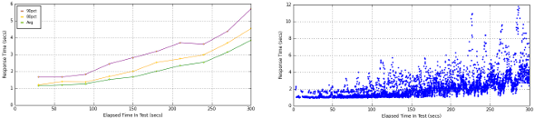

================================================
    Multi-Mechanize | Performance Test Framework
================================================

|

|

----

:Home: http://testutils.org/multimechanize
:Dev: http://github.com/cgoldberg/multi-mechanize
:PyPI: http://pypi.python.org/pypi/multimechanize
:License: GNU LGPLv3
:Author: Copyright (c) 2010-2012 Corey Goldberg

----

--------------------------------------
    Performance & Load Tests in Python
--------------------------------------

Multi-Mechanize is an open source framework for API performance and load testing. 
It allows you to run simultaneous Python scripts to generate synthetic transactions 
against a web site service.

You programmatically create test scripts to simulate virtual user activity. Your 
scripts will then generate HTTP requests to intelligently navigate a web site or 
send requests to a web service.

Multi-Mechanize uses a multi-process, multi-threaded engine to replay your scripts and 
generate concurrent virtual users.
    
Test output reports are saved as HTML (with PNG graphs), or JUnit-compatible XML for compatibility with 
CI systems.

----------------------
    Install / Download
----------------------

Multi-Mechanize can be installed from `PyPI <http://pypi.python.org/pypi/multimechanize>`_ using `pip <http://www.pip-installer.org>`_::
    
    pip install -U multimechanize

... or download the `source distribution from PyPI <http://pypi.python.org/pypi/multimechanize#downloads>`_, unarchive, and run::

    python setup.py install
    
-------------------------------
    Discussion / Help / Updates
-------------------------------

* IRC: #multimech (freenode)
* Google Group: http://groups.google.com/group/multi-mechanize
* Twitter: http://twitter.com/multimechanize

---------------
    Development
---------------

* GitHub: http://github.com/cgoldberg/multi-mechanize

-------------
    Site Menu
-------------

.. toctree::
    :maxdepth: 1
    
    configfile
    developing
    graphs
    faq
    changelog
   
----

.. image:: assets/python-powered.png
