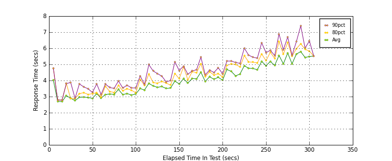
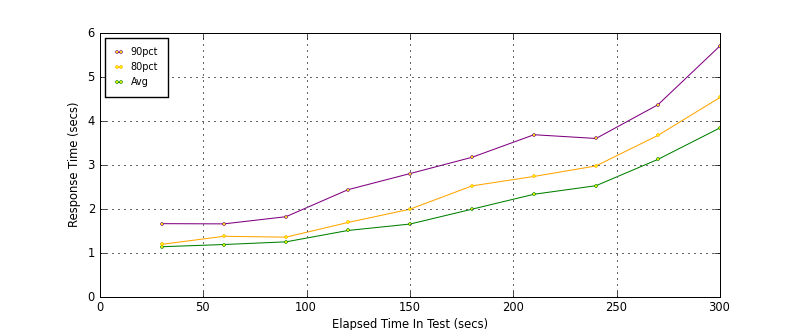
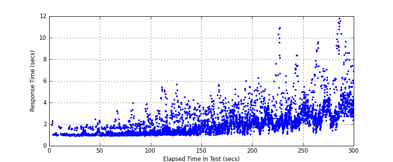
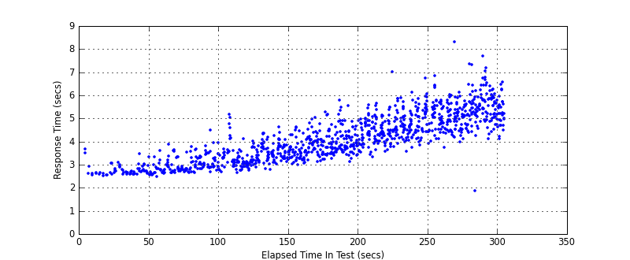
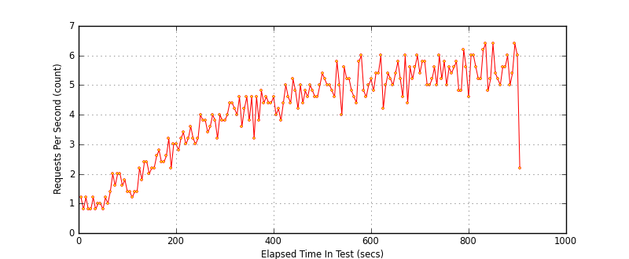
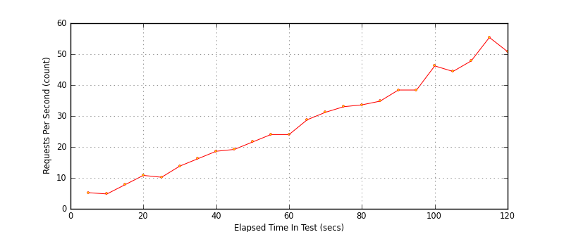

Sample Reports and Graphs
=========================

Sample Results Reports
----------------------

* `results.html 1 <./_static/sample_results/results_2010.02.17_12.48.07/results.html>`_
* `results.html 2 <./_static/sample_results/django_dev_server_results_2010.02.20_18.53.17/results.html>`_
* `results.html 3 <./_static/sample_results/membase_results_280thread_30min_2010.07.26_14.42.19/results.html>`_

Sample Graphs
-------------

(all samples generated by multi-mechanize using matplotlib)

